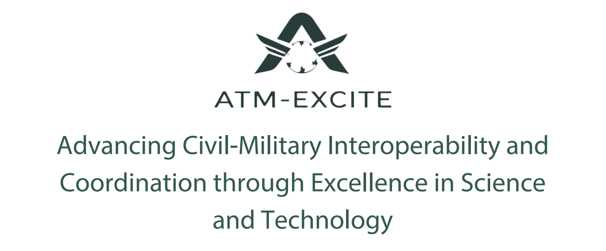

# SIMCOM - Multi-agent ATM simulation for attack evaluation on ASD-B communications

  

SIMCOM is one of the research solutions developed as part of the [ATM-EXCITE](https://atm-excite.eu/) project, funded by the [SESAR JU | Exploratory Research](https://www.sesarju.eu/exploratoryresearch) programme and led by [STAM S.r.l.](https://www.stamtech.com/)

The main objective of SIMCOM is to provide a flexible and extensible simulation framework designed to support in-depth research on the impact of cyber-attacks targeting the Automatic Dependent Surveillance–Broadcast (ADS-B) system, a cornerstone of modern air traffic surveillance. In particular, SIMCOM focuses on simulating vulnerabilities within ADS-B and their consequences on air traffic flow and control systems.

Beyond analyzing attack scenarios, SIMCOM also aims to serve as a testing ground for cyber-defense strategies. It enables users to implement, verify, and evaluate the effectiveness of various mitigation techniques in a controlled environment. SIMCOM is built upon <a href="https://github.com/TUDelft-CNS-ATM/bluesky">BlueSky</a>, an open-source research-grade air traffic management (ATM) simulator. By leveraging BlueSky's modular architecture, SIMCOM significantly extends its capabilities with additional features tailored to cyber-security experimentation.

## Background

<a href="https://skybrary.aero/articles/automatic-dependent-surveillance-broadcast-ads-b">ADS-B</a> is a surveillance technology increasingly adopted worldwide in both civil and military aviation. It is a cornerstone of next-generation air traffic management due to its ability to provide real-time, high-accuracy aircraft position data.

The system operates by using GNSS (Global Navigation Satellite System) to determine the aircraft’s position, which is then automatically broadcast—along with other flight information such as speed, heading, and identification—over radio frequencies. This broadcast happens continuously and over a wide geographical area, enabling both ground-based receivers and nearby aircraft to obtain situational awareness.

The ADS-B system consists of two distinct subsystems:
- ADS-B Out: Transmits the aircraft’s position and other data to external receivers.
- ADS-B In: Receives and decodes messages broadcast by other aircraft and ground stations.

While ADS-B offers significant improvements in terms of cost, coverage, and accuracy over traditional primary and secondary radar systems, it suffers from a critical shortcoming: it was not designed with security in mind. The standard ADS-B protocol used in civil aviation broadcasts unencrypted data in plain text, making it susceptible to eavesdropping, spoofing, message injection, and denial-of-service attacks (<a href="https://doi.org/10.1007/978-3-642-38980-1_16">Schäfer et al., 2013</a>). These vulnerabilities raise concerns about the system’s trustworthiness and hinder its full adoption as a radar replacement.

## The ATM-EXCITE Project

Although numerous cyber-security solutions for ADS-B have been proposed in the scientific literature, very few have transitioned from academic research into real-world applications. The ATM-EXCITE project aims to bridge this gap by advancing ADS-B security toward operational readiness.

One of the project’s core goals is to strengthen the ADS-B system with encryption and authentication mechanisms, improving both the safety and the resilience of air traffic surveillance systems. These enhancements are expected to benefit not only civil aviation but also civil-military cooperation, where secure and reliable airspace data sharing is paramount.

Within this context, SIMCOM plays a key role by offering a simulation-based platform where cyber-security strategies can be developed, validated, and stress-tested. The simulator allows stakeholders—including researchers, aviation authorities, and system integrators—to:

- Simulate various cyber-attack scenarios targeting ADS-B.
- Observe the operational impact on air traffic management.
- Experiment with and evaluate the effectiveness of defense mechanisms in realistic conditions.

SIMCOM thus represents a critical step toward building more secure, reliable, and resilient air traffic infrastructures.

## Installation

For installation instructions, refer to the original [BlueSky repository](https://github.com/TUDelft-CNS-ATM/bluesky).

## Sponsors

